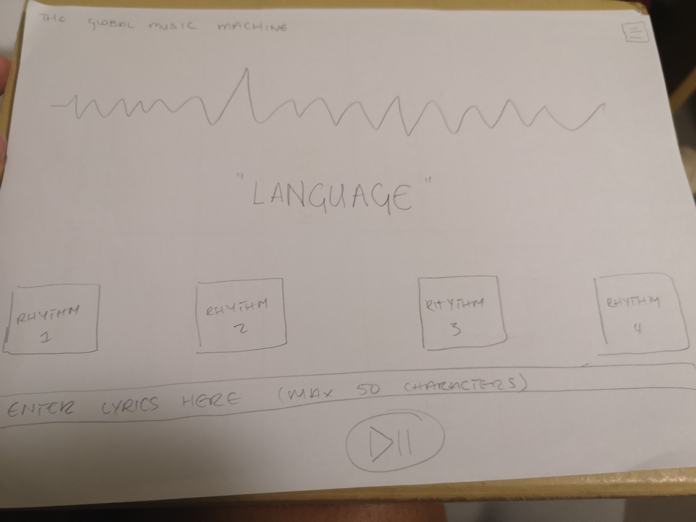
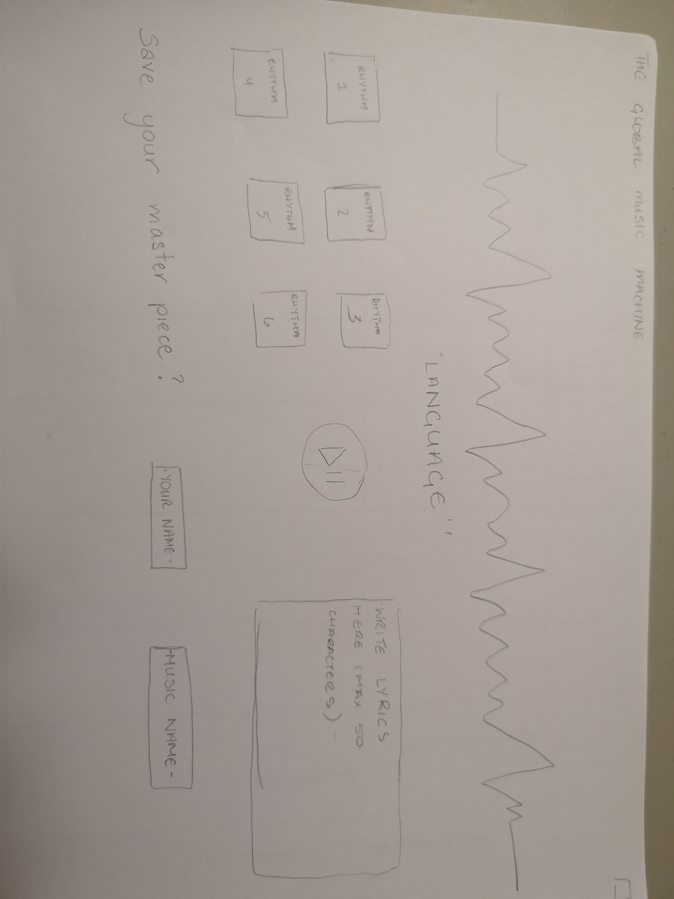
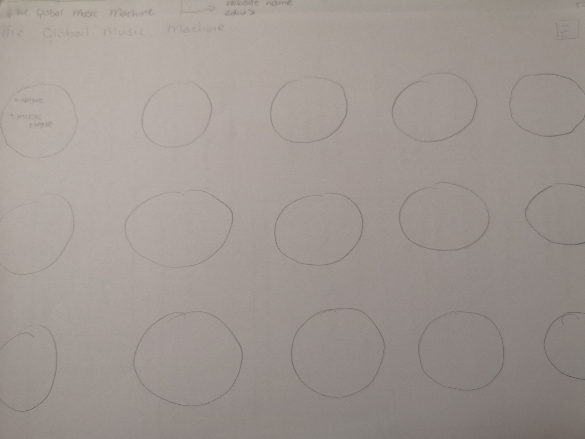

# Progress Report 1

## What I planned to do

The task was to do research on what we want to do for the final project with the following premises in mind:

* Researching Previous Work/Resources
* Find Examples
* Note Motivation for idea
* Make a design draft

## What I did

### Motivation

I have a facination with languages and really find the complexity between languages very intriguing. Hatim and I were discussing the final and since we both musical interests (we were in a band together) we brainstormed ways to include music into our project. Some how we thought of having a website which allowed the user to input lyrics that could be translated into other languages and added them to a background rhythm track. 
 
We acknowledge that this is a difficult task and I broke it down into smaller sub sections that could be tackled in order of priority.

### Find Examples

I looked up music APIs and chord generators to see if there were any projects which had similar goals before. I found the following sites:

### Reseach and Previous Work

Microsoft Azure has created a translating hologram together with HoloLens. However when trying to access the Microsoft Azure API I came across some verication problems. Sampanna suggested Yandex and after playing arounf the developer site, I think it should be relatively staight forward in using.

Additionally, I looked at the inspector panel for Chrome Music Maker. This site was a very big influence when I was fleshing out the design. Ideally I would want to make something close to this site but I don't think it is realistically. However, I still hold this site as well as [site name] as my main sources of inspiration.

### Design Draft

Below are images from the preliminary draft Drawings:

Design Draft 1 (Homepage)

Design Draft 2 (Homepage)

Design Draft 2 (Page storing musical files)

Wireframe of Homepage

## Next Steps

The next steps in this process would be:
* Create a skeleton webpage with follows wireframe1
* Fetch data from Yandex
* Consolidate last music files
