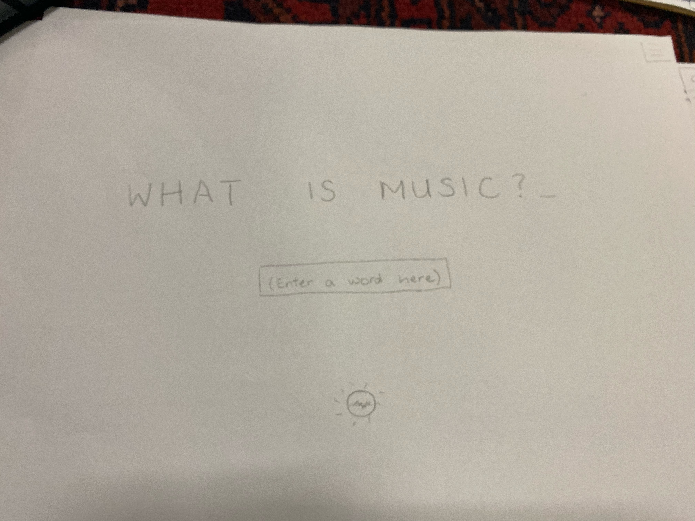
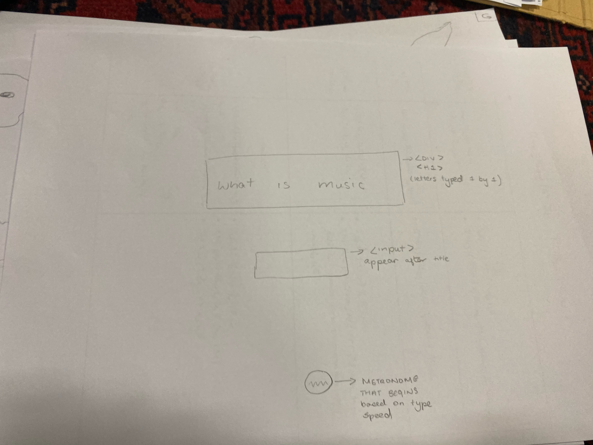
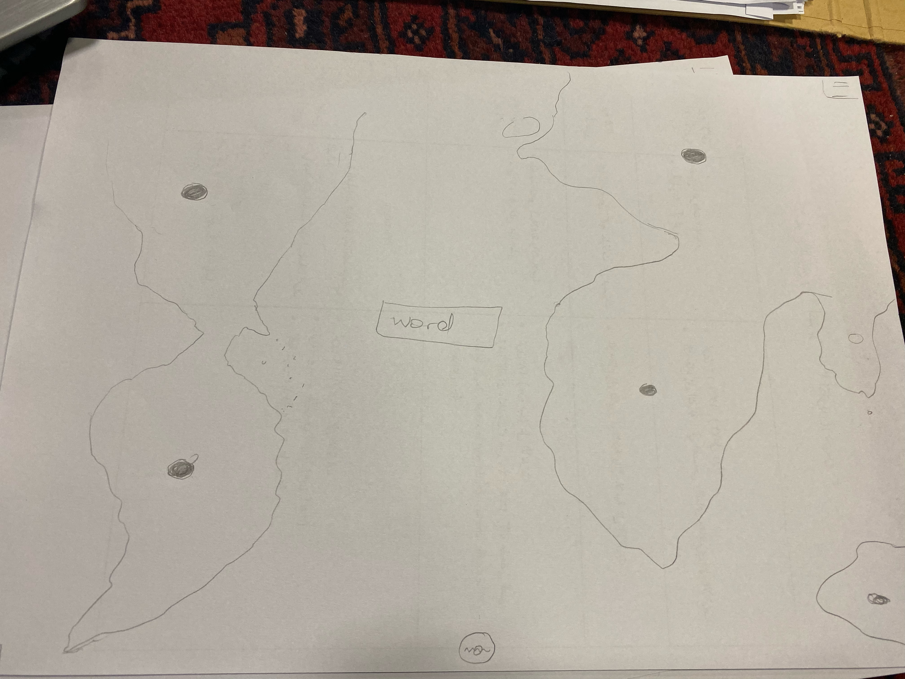
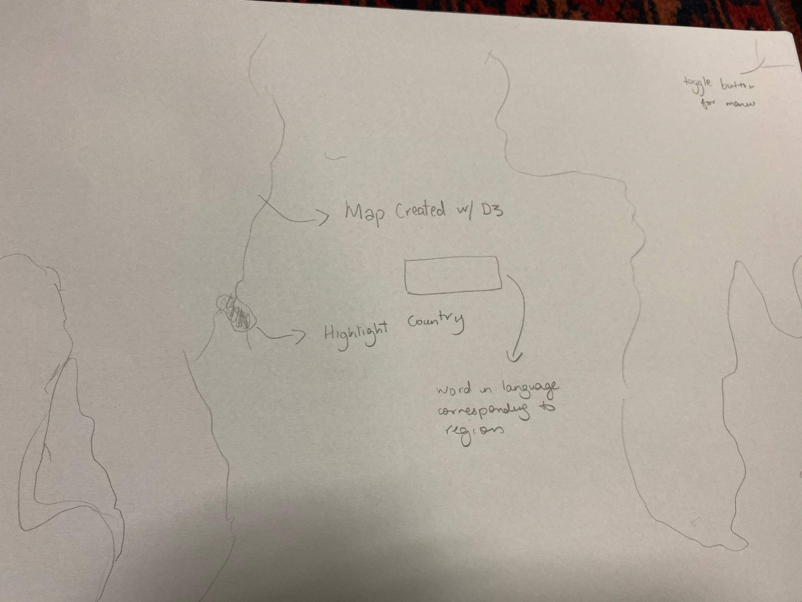
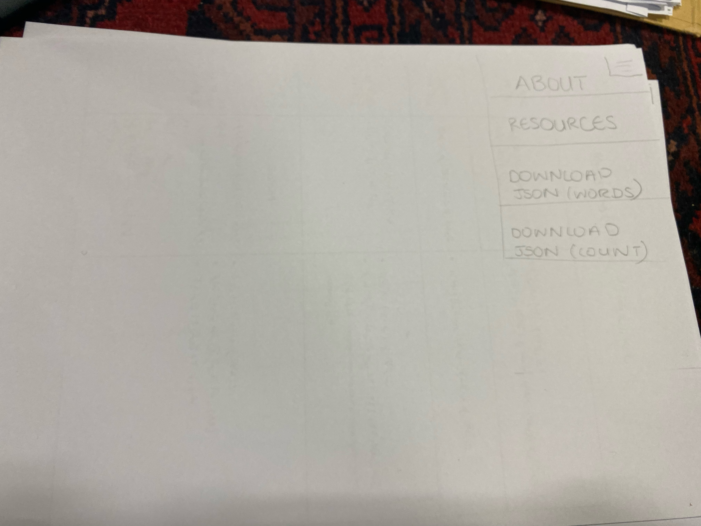

# Preogress Report 2

## Updated Proposal: Music Map

In Progess Report 1, I showcased the deign draft for a multilingual verse generator. Howeever, after consulting with my partner, we decided to change the website structure.
 
The new website will still use the languange translation API and rhythm generation but will be a bit more plausible given the fact that translation apps tend to be quite inacurate when entire sentences/paragraphs are referenced.

The website will have a home page with the question - What is music? and and input box. The user will get to input one word and depending on hthe speed at which the person types that word, a rhythm would be generated. 

### The rhythm

The rhythm will also correspond to musical keys by using MOD to map the alphabet to the musical scale and would therefore generate a repeated tune. 

 
 
The index would then lead you to a new page with a world map (propably generated using D3 and a geojson file) and the word typed would appear in the center. As diffirent countries are highlighted, the word would be translated into the language spoken in the highlighted region.

 

 

The server side will be included by storing the words used along with the name of the user. The two json files that could then be downloaded will be a file of 

* the user name and the word definition of music
* the word and a count of how many people 

These can be accessed via the menu button

## Steps to making this happen

* *Wednesday 20th*
  - Hatim: Rhythm Music Type
  - Gabi: Using Yandex API
    
* *Friday 22nd*
  - Hatim: Make Website Skeleton
  - Making API's
  
* *Wednesday 27th*
  - Hatim: Debugging
  - Gabi: Making Interactive Map
  
  ## Conclusion
  
  This website will be hard but if we time it well we could make it happen :)
  
  
  
  
